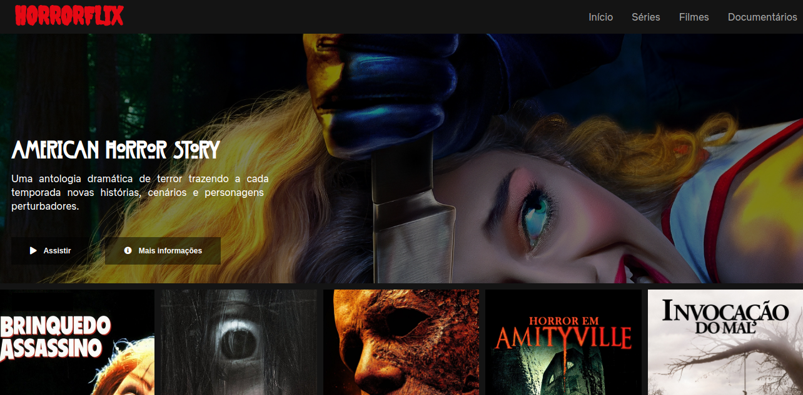

# HORRORFLIX





> Horrorflix é um clone do Netflix. Feito com Html, CSS, JavaScript e JQuery.

### ❤️ Ajustes e melhorias

O projeto ainda está em desenvolvimento e as próximas atualizações serão voltadas nas seguintes tarefas:

- [x] Projeto inicializado
- [x] Html
- [x] Style
- [x] Carousel
- [ ] Buttons funcionais
- [ ] Projeto Finalizado


## 🩸 Instalando `<Horrorflix>`

Para instalar o `<Horrorflix>`, siga estas etapas:

Clone o projeto:
```
<git clone https://github.com/danielafarias/Horrorflix.git>
```

## 🔪 Usando `<Horrorflix>`

Para usar `<Horrorflix>`, abra o arquivo:

```
<index.html>
```


## 🏚 Contribuindo para `<Horrorflix>`

Para contribuir com `<Horrorflix>`, siga estas etapas:

1. Bifurque este repositório.
2. Crie um branch: `git checkout -b <horrorflix_seu_nome>`.
3. Faça suas alterações e confirme-as: `git commit -m '<sua_mensagem_de_commit>'`
4. Envie para o branch original: `git push origin <master> / <https://github.com/danielafarias/Horrorflix.git>`
5. Crie a solicitação de pull.

Como alternativa, consulte a documentação do GitHub em [como criar uma solicitação pull](https://help.github.com/en/github/collaborating-with-issues-and-pull-requests/creating-a-pull-request).

## 🧛🏻‍♀️ Colaboradores

Seguintes pessoas que contribuíram para este projeto:

<table>
  <tr>
    <td align="center">
      <a href="https://github.com/danielafarias">
        <br>
        <sub>
          <b>Daniela Farias</b>
        </sub>
      </a>
    </td>
    
  </tr>
</table>

## 📜 Licença

Esse projeto está sob licença MIT ⚖️. Veja o arquivo [LICENÇA](LICENSE.md) para mais detalhes.

[⬆ Voltar ao topo](#horrorflix)<br>

```
© README.md template by iuricode
```
